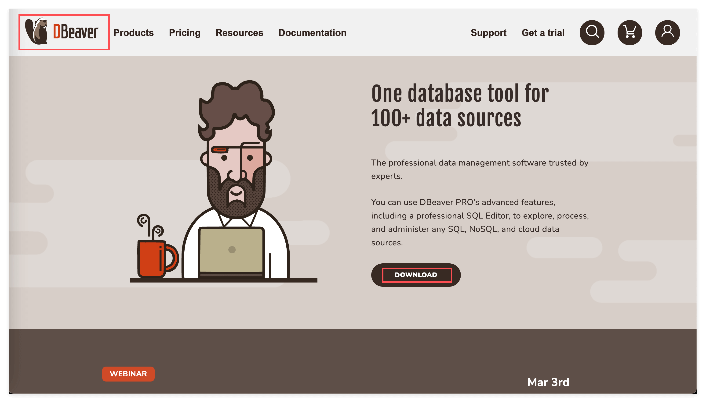
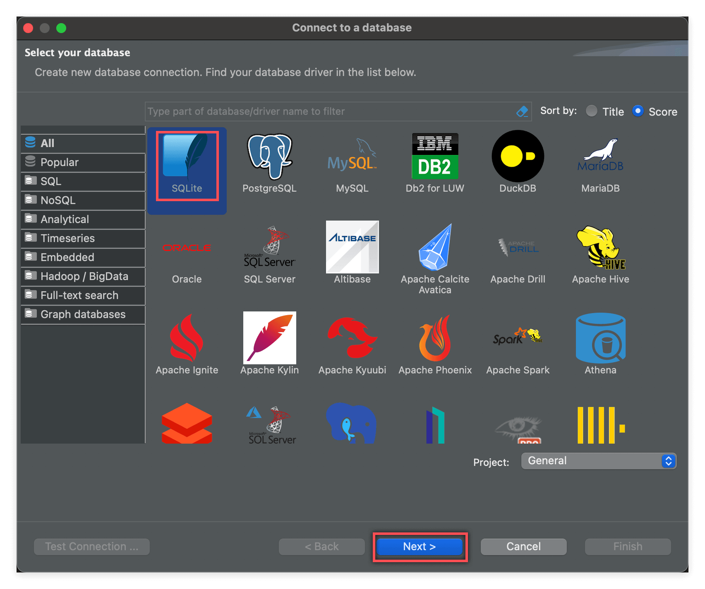
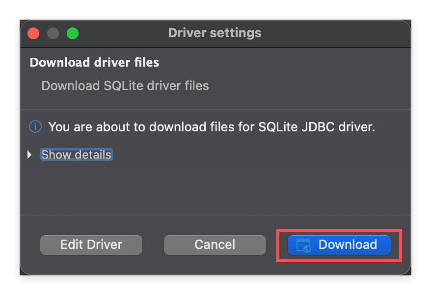
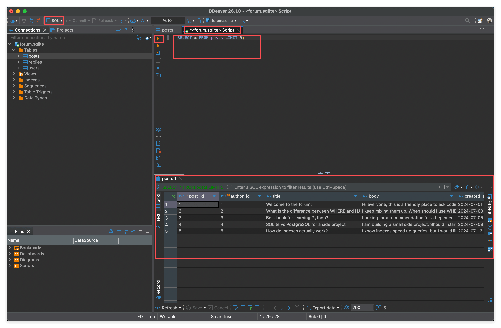

# 01 — Sharpen Your Tools: Set Up DBeaver and Explore Your First Database

> *"A workman must first sharpen his tools."* — Confucius
>
> Before you write a single line of SQL, get your tools in order: install DBeaver, connect to a ready-made SQLite database, see what's inside, and run the simplest possible query. If you can do that by the end of this lesson, you're done.

---

## What you'll learn in this lesson

1. Download and install **DBeaver Community** (the free edition — it's plenty for learning).
2. Use DBeaver to connect to a local **SQLite** database (a single `.sqlite` file *is* the entire database).
3. **Preview table data** through the GUI.
4. Open the SQL editor and write a query to **pull data out**.

> We're sticking to "just enough" here. This lesson does not teach SQL syntax — `SELECT`, `WHERE`, `JOIN` and friends start in the next lesson.

---

## About the database for this lesson

We've included a small forum database, `forum.sqlite`, right inside this folder. **It's committed to git**, so once you clone the repo it's ready to go — no downloads required.

It has three tables and models the simplest possible "post + reply" system you'd find on any message board:

| Table | What it is | Relationship |
|---|---|---|
| `users` | Forum members | One user can write many posts and many replies |
| `posts` | Top-level posts | Each post belongs to one author (`author_id → users`) |
| `replies` | Replies | Each reply hangs off one post (`post_id → posts`) and is written by one user (`author_id → users`) |

**One business rule we deliberately enforced**: replies are **flat** — you cannot reply to a reply. (That's why there's no `parent_reply_id` column on `replies`.) This keeps the schema simple enough that when we get to `JOIN`, we only introduce one layer of relationship at a time.

Size: 8 users, 12 posts, 30 replies. The topics are all tech-discussion-flavored (SQL questions, Python book recommendations, tabs vs. spaces — that sort of thing).

### Want to rebuild the database yourself?

`forum.sqlite` is generated from two SQL files under `sql/` by `build_db.py`. It's fully reproducible — if you accidentally mess up the file, just run:

```bash
python3 examples/01-sharpen-your-tools/build_db.py
```

and it will be regenerated from scratch. The SQL source files are:

- [`sql/01_schema.sql`](./sql/01_schema.sql) — the `CREATE TABLE` statements for all three tables
- [`sql/02_seed.sql`](./sql/02_seed.sql) — the `INSERT` statements that seed the data

> You don't need to understand these two SQL files yet — just know they're there. We'll walk through them line by line in the next lesson.

---

## Step 1: Download DBeaver Community (the free edition)

Go to [https://dbeaver.io](https://dbeaver.io) and click **DOWNLOAD**.

Make sure you grab the **Community** edition — it's **free, open source, and has every feature you'll need for learning**. The front page tends to push the PRO (paid) edition; don't get sidetracked.



Install it the normal way for your platform: on macOS drag it into Applications, on Windows run the installer, on Linux use your package manager.

---

## Step 2: Create a new database connection

Open DBeaver. In the top-left corner there's a small "plug with a +" icon — that's **New Database Connection**. Click it.


> **Side note**: DBeaver is a *universal client* — the same tool can connect to SQLite, PostgreSQL, MySQL, ClickHouse, and dozens of others through the same flow. For learning we only use SQLite because it's the simplest: **a single `.sqlite` file is the whole database**. No server to install, no port to configure, no users to create.

---

## Step 3: Pick SQLite as the database type

In the dialog that pops up, select **SQLite** and click **Next**.



---

## Step 4: Point it at your local `forum.sqlite` file

In the **Path** field, click **Open** and browse to the `forum.sqlite` file in this folder.

Once it's filled in, click **Test Connection ...** in the bottom-left to try the connection.


### First time connecting to SQLite: let DBeaver download the driver

The first time you connect to a SQLite database, DBeaver will pop up a **Driver settings** dialog asking to download the SQLite JDBC driver. Just click **Download** — it takes a few seconds.



Once the driver is installed, you'll be back at the previous screen. Click **Test Connection** again — you should see "Connected". Click **Finish** to save the connection.

---

## Step 5: Preview the data (the GUI way)

Once connected, look at the **Database Navigator** panel on the left. Expand `forum.sqlite` → **Tables** and you'll see all three tables: `posts` / `replies` / `users`.

**Double-click any table, then switch to the `Data` tab**, and you'll see every row in that table — laid out exactly like an Excel spreadsheet.


This is the fastest way to get a feel for what a database actually looks like: what the column names are, what fields exist, what the data roughly resembles — all visible at a glance.

> **Suggestion**: double-click each of `users`, `posts`, and `replies` and skim their `Data` tabs. It'll give you an intuitive picture of how this little forum is structured.

---

## Step 6: Write a SQL query

Looking is one thing — real SQL learning starts when you write your first query.

Click the **SQL** button on the toolbar (or use the menu *SQL Editor → New SQL Editor*) to open a SQL editor tab. Type:

```sql
SELECT * FROM posts LIMIT 5;
```

Then press **Ctrl+Enter** (or **Cmd+Enter** on macOS) to run it. A result grid will appear in the bottom panel.



This query is about as simple as SQL gets:

- `SELECT *` — give me every column
- `FROM posts` — from the `posts` table
- `LIMIT 5` — only the first 5 rows

### Handy trick: run only the highlighted statement

You can keep many SQL statements in one editor tab at the same time. To run only one of them, **highlight that statement with your mouse** and then press `Cmd+Enter` — DBeaver will execute only the highlighted portion.

In the screenshot below, `SELECT * FROM users LIMIT 5;` is highlighted, so pressing `Cmd+Enter` runs just that one query, and the result grid shows the first 5 rows of `users`:


Try it with all three tables:

```sql
SELECT * FROM posts LIMIT 5;
SELECT * FROM users LIMIT 5;
SELECT * FROM replies LIMIT 5;
```

Highlight each line (or just place the cursor on it) and run them one by one. Compare the result grids to see what fields each table holds.

---

## Four takeaways from this lesson

1. **DBeaver Community is free** — you do not need PRO to learn.
2. **Connecting to a local SQLite database = pick the SQLite driver + point at the `.sqlite` file.** That's it.
3. **Double-click a table → Data tab** is the fastest way to preview data.
4. **`SELECT * FROM table_name LIMIT 5;`** is the one SQL statement to memorize today. Every lesson after this builds on top of it.

See you in the next lesson 👋
