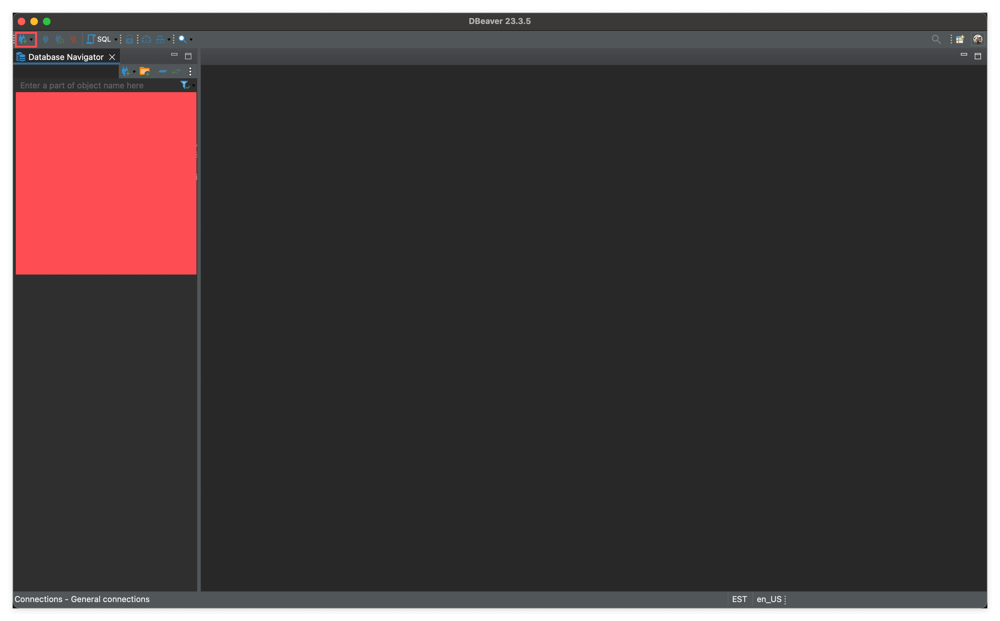
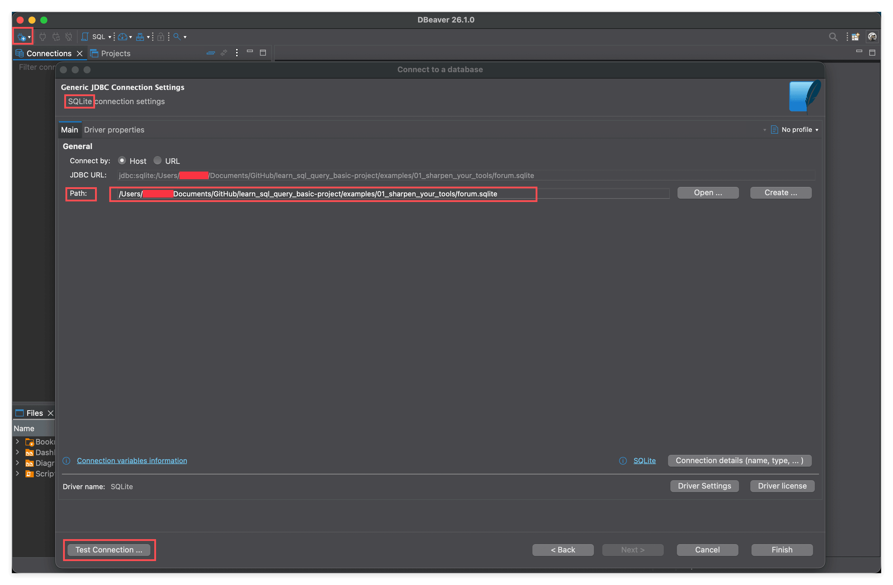
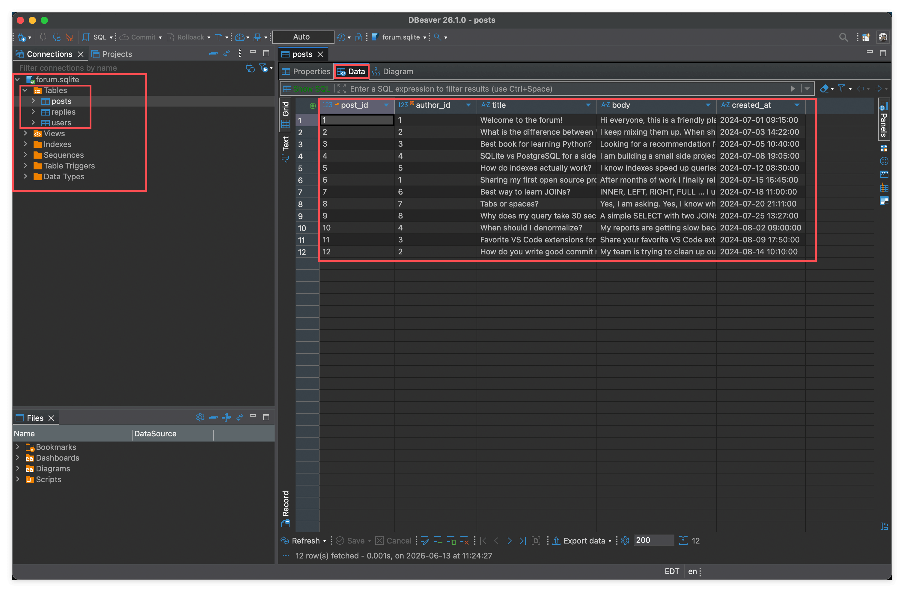
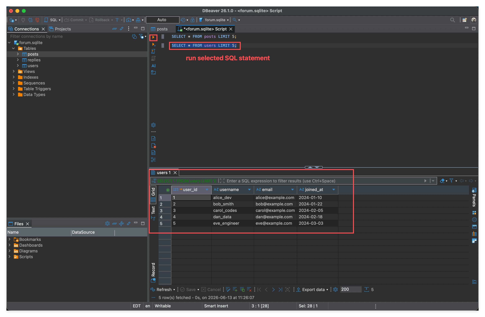

# 01 — Sharpen Your Tools: Set Up DBeaver and Explore Your First Database

> 工欲善其事，必先利其器。
>
> 在写 SQL 之前，先把工具准备好：装一个 DBeaver，连上一份现成的 SQLite 数据库，能看见里面有什么、能跑一条最简单的查询，这节课的目标就达成了。

---

## 这节课你会学到

1. 下载并安装 **DBeaver Community**（免费版本，学习够用）。
2. 用 DBeaver 连接一个本地 **SQLite** 数据库（一个 `.sqlite` 文件就是一个完整的数据库）。
3. 在图形界面里 **预览表的数据**。
4. 打开 SQL 编辑器，写一条 SQL **查询数据**。

> 我们只学"够用"的部分。本课不教 SQL 语法，下一节课开始才正式讲 `SELECT`、`WHERE`、`JOIN`。

---

## 关于这节课的数据库

我们提供了一个小型论坛数据库 `forum.sqlite`，已经放在本目录下，**直接进了 git**，clone 仓库就能用，不需要再下载。

它一共三张表，模拟最朴素的"发帖 + 回帖"系统：

| 表名 | 含义 | 关系 |
|------|------|------|
| `users` | 论坛成员 | 一个用户可以发很多帖子、很多回复 |
| `posts` | 主帖 | 每个主帖属于一个作者（`author_id → users`） |
| `replies` | 回复 | 每条回复挂在某个主帖下面（`post_id → posts`），由一个用户写（`author_id → users`） |

**特意约定的业务规则**：回复是**扁平**的——一条回复不能再被回复（所以 `replies` 表里没有 `parent_reply_id` 这种字段）。这让 schema 足够简单，方便后面学 `JOIN` 时一次只引入一层关联。

数据规模：8 个用户、12 个主帖、30 条回复，话题围绕"技术讨论"展开（SQL、Python、JOIN、commit message 之类）。

### 想自己重建数据库？

`forum.sqlite` 由 `build_db.py` 从 `sql/` 目录下的两个 SQL 文件生成，完全可复现。如果不小心改坏了，只要：

```bash
python3 examples/01_sharpen_your_tools/build_db.py
```

就会重新生成。SQL 源文件在：

- [`sql/01_schema.sql`](./sql/01_schema.sql) — 三张表的 `CREATE TABLE`
- [`sql/02_seed.sql`](./sql/02_seed.sql) — `INSERT` 种子数据

> 这两个 SQL 文件你现在不需要看懂，先有个印象就好。下一节课我们会逐行讲。

---

## 步骤 1：下载 DBeaver Community（免费版本）

打开 [https://dbeaver.io](https://dbeaver.io)，点击 **DOWNLOAD**。

注意只下 **Community** 版本，**免费、开源、功能完全够学习用**。官网首页推销的是 PRO 版（付费），不要被带偏。


下载完按平台正常安装即可（macOS 拖进 Applications，Windows 跑 installer，Linux 用包管理器）。

---

## 步骤 2：新建一个数据库连接

打开 DBeaver，左上角那个"插头 +"图标就是 **New Database Connection**，点它。



> 小知识：DBeaver 是个"通用客户端"——一个工具能连 SQLite、PostgreSQL、MySQL、ClickHouse……都是同样的入口。学习阶段我们只用 SQLite，因为它最简单：**一个 `.sqlite` 文件就是一个数据库**，不用装服务器、不用配端口、不用建用户。

---

## 步骤 3：选择数据库类型 SQLite

在弹出的对话框里选 **SQLite**，点 **Next**。


---

## 步骤 4：指向本地的 `forum.sqlite` 文件

在 **Path** 一栏点 **Open**，找到本目录下的 `forum.sqlite` 文件选中。

填好后点左下角的 **Test Connection ...** 测试连接。



### 第一次连 SQLite：让 DBeaver 下载驱动

如果是第一次用 DBeaver 连 SQLite，它会弹一个 **Driver settings** 对话框，提示要下载 SQLite JDBC 驱动。点 **Download** 即可，等几秒就装好了。


驱动装完后回到上一步，再点一次 **Test Connection**，看到 "Connected" 就成功了。最后点 **Finish** 完成。

---

## 步骤 5：预览表的数据（图形化方式）

连上之后，左侧的 **Database Navigator** 里能看到 `forum.sqlite` → **Tables**，展开会看到三张表：`posts` / `replies` / `users`。

**双击任意一张表，再切到 `Data` 标签页**，就能直接看到表里的所有数据，跟看 Excel 一样。



这是最快理解数据库长什么样的方式：列名是什么、有哪些字段、数据大概是什么样——一眼就看清楚了。

> **建议**：把 `users`、`posts`、`replies` 三张表都双击一遍，分别看看 `Data` 标签里的内容，对这个论坛的数据结构建立直观印象。

---

## 步骤 6：写一条 SQL 查询数据

光"看"还不够，真正的 SQL 学习从"写"开始。

点击工具栏的 **SQL** 按钮（或菜单 *SQL Editor → New SQL Editor*），打开一个 SQL 编辑器标签页。在里面输入：

```sql
SELECT * FROM posts LIMIT 5;
```

然后按 **Ctrl+Enter**（macOS 是 **Cmd+Enter**）执行，下方会出现结果表格。


这条 SQL 的意思非常朴素：

- `SELECT *`：选出所有列
- `FROM posts`：从 `posts` 这张表里
- `LIMIT 5`：只要前 5 行

### 小技巧：只执行选中的那条 SQL

编辑器里可以同时写很多条 SQL。如果只想跑其中一条，**用鼠标把那条 SQL 选中**，再按 `Cmd+Enter`，DBeaver 就只会执行选中的部分。

下图里 `SELECT * FROM users LIMIT 5;` 被选中，按下 `Cmd+Enter` 只运行了它，下面结果就是 `users` 表的前 5 行：



写多条 SQL 试一试：

```sql
SELECT * FROM posts LIMIT 5;
SELECT * FROM users LIMIT 5;
SELECT * FROM replies LIMIT 5;
```

把光标分别放到每一条上（或者直接选中那一条），逐条 `Cmd+Enter` 执行，对照结果看每张表里都有什么字段。

---

## 这节课要带走的四件事

1. **DBeaver Community 是免费的**，学习阶段不需要 PRO。
2. **连接本地 SQLite = 选 SQLite 驱动 + 指向 `.sqlite` 文件**，没有别的步骤。
3. **双击表 → Data 标签** 是预览数据最快的方式。
4. **`SELECT * FROM 表名 LIMIT 5;`** 是你这节课唯一需要记住的 SQL，下一节课开始我们会在它的基础上不断加东西。

下节课见 👋
